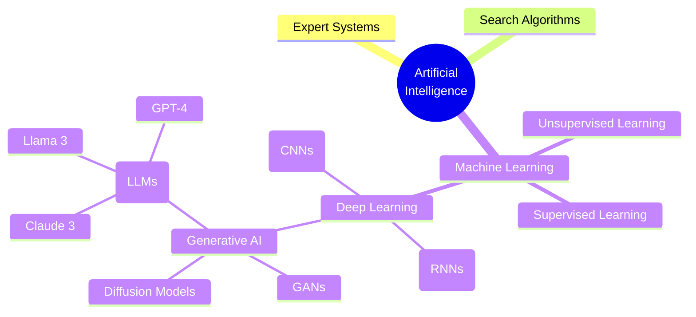
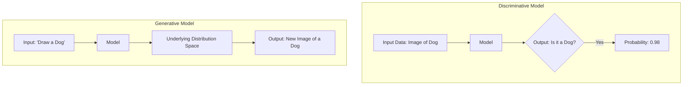

# Day 1: Introduction to Artificial Intelligence, Machine Learning, Deep Learning, Generative AI, and LLMs

## 1. Lesson Metadata
- **Lesson Title:** Introduction to AI, ML, DL, GenAI, and LLMs
- **Duration:** 2-3 hours
- **Difficulty:** Beginner to Intermediate
- **Estimated Study Time:** 2.5 hours
- **Learning Objectives:**
  - Understand the distinct boundaries and overlaps between AI, ML, DL, and GenAI.
  - Grasp the fundamental concepts that power Large Language Models (LLMs).
  - Identify production-grade use cases for Generative AI in the modern enterprise.
  - Differentiate between traditional predictive ML and generative ML.
- **Prerequisites:** Basic understanding of programming concepts; no prior ML experience required.
- **Expected Outcomes:** By the end of this lesson, you will be able to clearly define the hierarchy of AI fields, understand the basic mechanism of generative models, and confidently discuss these technologies using industry-standard terminology.

---

## 2. Theory Section

### Definitions & The AI Hierarchy
To build production AI systems, we first need to establish a precise taxonomy. The field of AI is nested, with each subsequent layer representing a more specialized set of capabilities.

1. **Artificial Intelligence (AI):** The broadest concept. It encompasses any technique that enables computers to mimic human intelligence, using logic, if-then rules, decision trees, or machine learning.
2. **Machine Learning (ML):** A subset of AI that includes statistical techniques that enable machines to improve at tasks with experience (data). Instead of explicit programming, algorithms learn patterns.
3. **Deep Learning (DL):** A subset of ML composed of algorithms that permit software to train itself to perform tasks, like speech and image recognition, by exposing multilayered artificial neural networks to vast amounts of data.
4. **Generative AI (GenAI):** A subset of DL (and ML) that can generate new content—text, images, audio, or video—based on learned data distributions.
5. **Large Language Models (LLMs):** A specific type of GenAI specialized in understanding and generating human language, characterized by massive scale (billions of parameters) and trained on vast corpora of text.

### Why it Exists & Problems it Solves
Historically, software required explicit rules (Software 1.0). If you wanted to classify an email as spam, you wrote a list of keywords. This was rigid and unscalable.
Machine Learning introduced Software 2.0: writing code that learns the rules from data. However, traditional ML was mostly **predictive** (e.g., predicting a house price) or **discriminative** (e.g., classifying an image as a cat or dog).
Generative AI solves the problem of **creation**. It answers the question: "Can a machine understand the underlying distribution of a dataset well enough to sample from it and create something entirely new and coherent?"

### Internal Working: Discriminative vs. Generative
- **Discriminative Models:** Learn the boundary between classes. Mathematically, they learn $P(Y|X)$ — the probability of label Y given data X.
- **Generative Models:** Learn the distribution of the individual classes. They learn $P(X, Y)$ or just $P(X)$ — the probability of the data itself. By understanding how the data is distributed, they can generate new data points $X_{new}$.

### Advantages
- **Flexibility:** Modern LLMs are "few-shot" or "zero-shot" learners. A single foundational model can perform translation, summarization, and coding without retraining.
- **Contextual Understanding:** Deep learning architectures, specifically Transformers (which we will cover on Day 3), allow models to retain long-range context.

### Limitations
- **Hallucinations:** Generative models are probabilistic; they predict the most likely next token, which can lead to mathematically plausible but factually incorrect outputs.
- **Compute Constraints:** Training an LLM requires thousands of GPUs and millions of dollars. Even inference requires heavy optimization (quantization, vLLM) for production deployment.

### Real-world Examples & Production Use Cases
- **Customer Support Automation:** Replacing decision-tree chatbots with LLM-powered RAG (Retrieval-Augmented Generation) agents.
- **Code Generation:** GitHub Copilot, built on OpenAI's models, autocomplete entire functions.
- **Data Extraction:** Using LLMs to parse unstructured PDFs into structured JSON for downstream ETL pipelines.

### Industry Best Practices
- **Never trust user input (Prompt Injection):** Always sanitize inputs and use system prompts rigidly.
- **Evaluation is harder than building:** Setting up an LLM is easy. Evaluating its outputs requires robust frameworks like LLM-as-a-Judge or RAGAS.
- **Start small:** Don't use GPT-4 for everything. If a fast, cheap model (like Llama-3-8B or GPT-3.5) can do the task, use it.

---

## 3. Architecture Section

### The AI Hierarchy Diagram



### Discriminative vs. Generative Flow



---

## 4. Code Examples

While we won't build an LLM from scratch today, we will simulate the difference between a rule-based system, a predictive model, and a generative model conceptually in Python.

```python
"""
Filename: ai_paradigms_demo.py
Description: Demonstrating the shift from Rule-Based to Generative paradigms.
"""

import random

# 1. Rule-Based System (Expert System)
# Hardcoded logic. Very brittle.
def rule_based_chatbot(user_input):
    """Answers based on strict string matching."""
    input_lower = user_input.lower()
    if "hello" in input_lower:
        return "Hi there!"
    elif "price" in input_lower:
        return "Our prices start at $99."
    else:
        return "I don't understand."

# 2. Predictive/Discriminative Model (Simulated)
# In reality, this would use sklearn or PyTorch.
def predictive_spam_filter(text):
    """Predicts a class (Spam or Not Spam) based on features."""
    spam_words = ['free', 'win', 'money', 'urgent']
    # Calculate a simple feature score
    score = sum(1 for word in text.lower().split() if word in spam_words)
    
    # Boundary decision
    if score >= 2:
        return {"class": "Spam", "confidence": 0.85}
    return {"class": "Not Spam", "confidence": 0.92}

# 3. Generative Model (Markov Chain Simulation)
# A primitive way of generating text based on probabilities of the next word.
class SimpleGenerativeModel:
    def __init__(self):
        # Maps a word to a list of possible next words
        self.transitions = {
            "the": ["cat", "dog", "AI"],
            "cat": ["sat", "slept"],
            "dog": ["barked", "ran"],
            "AI": ["generated", "learned"],
            "sat": ["on"],
            "generated": ["code", "text"],
        }
        
    def generate(self, start_word, max_length=5):
        """Generates a sequence of words based on learned transitions."""
        current_word = start_word
        output = [current_word]
        
        for _ in range(max_length - 1):
            next_options = self.transitions.get(current_word, None)
            if not next_options:
                break # Stop if no known transitions
            
            # Randomly sample the next word (simulating probability distributions)
            current_word = random.choice(next_options)
            output.append(current_word)
            
        return " ".join(output)

# --- Execution ---
if __name__ == "__main__":
    print("--- Rule-Based ---")
    print(rule_based_chatbot("Hello, what is the price?"))
    
    print("\n--- Predictive ML ---")
    print(predictive_spam_filter("URGENT win free money now"))
    
    print("\n--- Generative AI (Simulated) ---")
    gen_model = SimpleGenerativeModel()
    print(gen_model.generate("the", max_length=4))
```

---

## 5. Hands-on Exercise

### Easy
**Task:** Run the provided Python script. Modify the `predictive_spam_filter` to include three more spam trigger words and test it with a new sentence.

### Medium
**Task:** Expand the `SimpleGenerativeModel`'s dictionary to include at least 20 words. Attempt to generate a sentence starting with the word "generative".

### Hard
**Task:** Write a Python function that uses a third-party API (like OpenAI, Hugging Face Inference API, or Groq) to demonstrate true generative capabilities. Send a prompt and print the response. Implement error handling for API timeouts.

---

## 6. Mini Assignment
**Implement a Basic N-Gram Generator:**
Write a Python script that takes a paragraph of text as input, calculates the frequency of bigrams (two-word sequences), and uses those frequencies to generate a new 10-word sentence.

**Expected Output:**
```text
Input text: "I love coding. I love AI. AI is the future."
Generated: "I love AI is the future." (Randomized based on frequencies)
```

---

## 7. Coding Challenge

**Problem Statement:**
You are building an intent classifier for a GenAI routing system. Before sending a query to a massive, expensive LLM, you want to route simple factual queries to a cheaper database search. 
Write a function `route_query(query)` that takes a string. If the string starts with "Who", "What", "When", or "Where" (case-insensitive), return `"DATABASE"`. Otherwise, return `"LLM"`.

**Input:** A string `query`.
**Output:** A string: either `"DATABASE"` or `"LLM"`.

**Constraints:**
- Length of query: $1 \le len(query) \le 1000$
- No leading spaces.

**Starter Code:**
```python
def route_query(query: str) -> str:
    # Your code here
    pass
```

**Solution:**
```python
def route_query(query: str) -> str:
    question_words = ("who", "what", "when", "where")
    # Split to get the first word, convert to lowercase
    first_word = query.split()[0].lower()
    
    if first_word in question_words:
        return "DATABASE"
    return "LLM"
```

**Hidden Test Cases:**
1. `route_query("What is the capital of France?")` -> `"DATABASE"`
2. `route_query("Write a poem about the ocean.")` -> `"LLM"`
3. `route_query("WHERE did the event happen?")` -> `"DATABASE"`
4. `route_query("Summarize this article.")` -> `"LLM"`

---

## 8. Quiz

1. **Which of the following represents the correct hierarchical relationship?**
   - A) ML ⊂ AI ⊂ DL ⊂ GenAI
   - B) GenAI ⊂ DL ⊂ ML ⊂ AI
   - C) AI ⊂ ML ⊂ DL ⊂ GenAI
   - D) DL ⊂ GenAI ⊂ AI ⊂ ML
   - **Correct Answer:** B
   - **Explanation:** Artificial Intelligence is the broad field. Machine Learning is a subset of AI. Deep Learning is a subset of ML using neural networks. Generative AI is a subset of Deep Learning focused on content creation.

2. **What is the primary difference between discriminative and generative models?**
   - A) Discriminative models generate data, generative models classify it.
   - B) Discriminative models learn boundaries between classes; generative models learn the distribution of classes.
   - C) Generative models are Rule-Based.
   - D) There is no mathematical difference.
   - **Correct Answer:** B
   - **Explanation:** Discriminative models map input X to label Y (classification). Generative models capture the underlying probability distribution of the data to create new instances.

3. **What does LLM stand for?**
   - A) Logical Language Machine
   - B) Large Linear Model
   - C) Large Language Model
   - D) Latent Language Mechanism
   - **Correct Answer:** C
   - **Explanation:** LLM stands for Large Language Model, denoting neural networks with billions of parameters trained on massive text datasets.

4. **Which approach is considered "Software 2.0"?**
   - A) Writing explicit if-else logic.
   - B) Hardcoding algorithms in C++.
   - C) Using neural networks that learn rules from data.
   - D) Writing SQL databases.
   - **Correct Answer:** C
   - **Explanation:** Software 2.0 is a term coined by Andrej Karpathy to describe programming via optimization (training neural networks) rather than writing explicit instructions.

5. **In the context of LLMs, what is a "hallucination"?**
   - A) When the GPU overheats.
   - B) When the model generates plausible but factually incorrect or nonsensical information.
   - C) When the model refuses to answer a prompt.
   - D) When the model copies data exactly from its training set.
   - **Correct Answer:** B
   - **Explanation:** Because LLMs are probabilistic token predictors, they can sometimes string together words that sound highly confident but are entirely fabricated.

6. **Why are LLMs considered "Few-Shot" learners?**
   - A) They require only a few GPUs to run.
   - B) They can perform a task after being shown just a few examples in the prompt, without retraining.
   - C) They only output a few words at a time.
   - D) They have very few parameters.
   - **Correct Answer:** B
   - **Explanation:** Unlike traditional ML which requires thousands of examples to fine-tune, LLMs can understand a new task through merely reading a few examples provided in the input prompt.

7. **Which is a common enterprise use case for Generative AI?**
   - A) Calculating exact payroll taxes using deterministic math.
   - B) Extracting structured JSON data from unstructured PDFs.
   - C) Storing user passwords securely.
   - D) Rendering 3D graphics in real-time gaming engines.
   - **Correct Answer:** B
   - **Explanation:** Generative AI excels at natural language understanding tasks, such as parsing unstructured text (like PDFs) and generating a structured JSON format from it.

8. **What is the main bottleneck when deploying LLMs in production?**
   - A) The models are too small.
   - B) Lack of Python developers.
   - C) Compute constraints (GPU memory and inference latency).
   - D) Inability to process text.
   - **Correct Answer:** C
   - **Explanation:** LLMs require massive amounts of VRAM and compute power, making latency and infrastructure costs the primary challenges in production.

9. **Which component is fundamentally responsible for an LLM's ability to maintain context over long texts?**
   - A) If-Else statements.
   - B) The Transformer Architecture.
   - C) Random Number Generators.
   - D) SQL Joins.
   - **Correct Answer:** B
   - **Explanation:** The Transformer architecture (introduced in 2017) uses self-attention mechanisms that allow the model to weigh the importance of all words in a sequence, enabling long-range context retention.

10. **When should you NOT use an LLM?**
    - A) To summarize an article.
    - B) To translate English to French.
    - C) To perform strict, deterministic arithmetic on a financial ledger.
    - D) To draft an email.
    - **Correct Answer:** C
    - **Explanation:** LLMs are probabilistic, not deterministic. They approximate answers based on token probabilities, making them highly unreliable for strict, exact mathematical operations without external tool integration.

---

## 9. Flashcards

1. **Front:** What is Machine Learning?
   **Back:** A subset of AI where systems learn patterns from data to improve performance without explicit programming.
   **Difficulty:** Easy

2. **Front:** What is Deep Learning?
   **Back:** A subset of ML utilizing multi-layered artificial neural networks.
   **Difficulty:** Easy

3. **Front:** Generative vs Discriminative: Which one learns $P(Y|X)$?
   **Back:** Discriminative models.
   **Difficulty:** Medium

4. **Front:** What defines an LLM?
   **Back:** Large Language Model: Deep neural network with billions of parameters, trained on massive text corpora, capable of understanding and generating human language.
   **Difficulty:** Easy

5. **Front:** What does "Software 2.0" refer to?
   **Back:** Programming via neural network training (learning rules from data) rather than writing explicit logic.
   **Difficulty:** Medium

6. **Front:** Name one major limitation of LLMs.
   **Back:** Hallucinations (generating plausible but false information).
   **Difficulty:** Easy

7. **Front:** What is Few-Shot Prompting?
   **Back:** Giving the model a few examples of the desired input-output behavior within the prompt before asking it to perform the task.
   **Difficulty:** Medium

8. **Front:** Why use a smaller model (like 8B parameters) over a massive one (like GPT-4) in production?
   **Back:** Lower latency, lower inference costs, and often sufficient performance for specific, narrow tasks.
   **Difficulty:** Hard

9. **Front:** What is the primary architecture behind modern LLMs?
   **Back:** The Transformer architecture.
   **Difficulty:** Easy

10. **Front:** What is RAG?
    **Back:** Retrieval-Augmented Generation: Supplying an LLM with relevant retrieved documents in the prompt to ground its answers in factual data.
    **Difficulty:** Medium

---

## 10. Interview Questions

### Beginner
**Q: How would you explain the difference between AI and Generative AI to a non-technical product manager?**
**Ideal Answer:** AI is the broad concept of making computers smart. Traditional AI usually acts like a judge—it looks at data and makes a decision, like deciding if an email is spam. Generative AI acts like an artist or writer—it looks at examples of data and creates completely new content, like writing a new email or drawing a picture.

### Intermediate
**Q: In what scenarios would you choose a traditional Machine Learning model over a Large Language Model?**
**Ideal Answer:** I would choose traditional ML for tasks involving structured tabular data, strict classification, or regression (like predicting house prices or user churn). Traditional ML is computationally cheaper, faster, and highly interpretable. LLMs are overkill for structured data and should be reserved for unstructured data tasks (text, code, image generation).

### Advanced
**Q: Explain the probabilistic nature of text generation. How does temperature affect this?**
**Ideal Answer:** LLMs generate text by computing a probability distribution over the entire vocabulary for the next token. By default, it uses a greedy approach or beam search to pick highly probable tokens. `Temperature` is a hyperparameter that scales the logits before the softmax function. A temperature of 1.0 keeps the original distribution. A temperature < 1 makes the distribution sharper (more deterministic, less creative). A temperature > 1 flattens the distribution (more random, more creative).

### HR-style / Conceptual
**Q: Tell me about a time you had to evaluate the risks of using AI in a project.**
**Ideal Answer:** In a previous evaluation of a customer-facing chatbot, I identified the risk of hallucination and prompt injection. To mitigate this, we decided not to expose the LLM directly to the user. Instead, we used a RAG pipeline where the LLM could only answer based on our internal knowledge base, and we implemented an intent-classification layer to handle toxic inputs before they ever reached the LLM.

---

## 11. Resources
- **Research Papers:** "Attention Is All You Need" (Vaswani et al., 2017) - The foundational paper for modern LLMs.
- **Blogs:** Andrej Karpathy's blog on "Software 2.0".
- **YouTube Videos:** "Let's build GPT: from scratch, in code, spelled out." by Andrej Karpathy.
- **Official Documentation:** OpenAI API documentation, Hugging Face Transformers documentation.
- **Books:** "Generative Deep Learning" by David Foster.

---

## 12. Real World Engineering
### How Top Tech Companies Use GenAI in Production
- **OpenAI & Anthropic:** They focus heavily on alignment (RLHF - Reinforcement Learning from Human Feedback) to ensure their foundation models are helpful and harmless. Their engineering challenge is primarily distributed training across thousands of GPUs and optimizing inference kernels (like FlashAttention).
- **GitHub (Microsoft):** GitHub Copilot relies on extremely low latency. To achieve this, they don't use the largest models available. They use highly optimized, smaller coding-specific models and rely heavily on **context window engineering**—extracting the most relevant pieces of a user's local codebase to inject into the prompt.
- **Enterprise Adoption (Trade-offs):** Most enterprises do not train foundation models. The real-world engineering decision is a trade-off between:
  1. **Proprietary APIs (OpenAI/Anthropic):** Fast time-to-market, high quality, but data privacy concerns and vendor lock-in.
  2. **Open Source (Llama 3/Mistral):** Total control, data privacy, but requires deep infrastructure expertise (MLOps, Kubernetes, vLLM) to host and scale inference efficiently.
