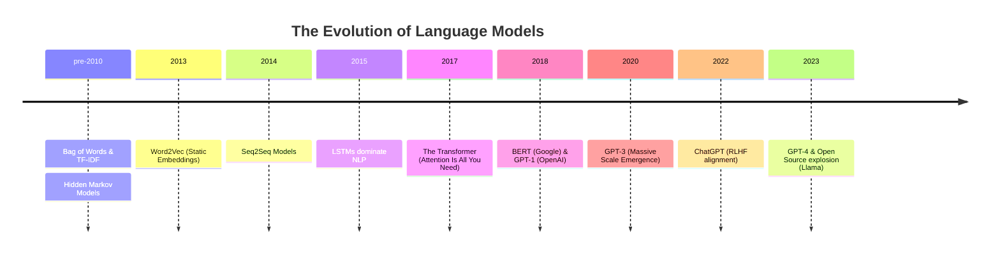

# Day 2: History of Language Models

## 1. Lesson Metadata
- **Lesson Title:** History of Language Models (BoW to GPT)
- **Duration:** 2-3 hours
- **Difficulty:** Intermediate
- **Estimated Study Time:** 3 hours
- **Learning Objectives:**
  - Trace the evolutionary timeline of Natural Language Processing (NLP).
  - Understand the math and intuition behind Bag of Words, TF-IDF, and Word2Vec.
  - Explain the necessity of sequential models (RNNs) and their limitations (vanishing gradients).
  - Understand how LSTMs solved short-term memory issues.
  - Grasp the paradigm shift introduced by the Transformer architecture and the GPT lineage.
- **Prerequisites:** Understanding of Day 1 concepts, basic Python.
- **Expected Outcomes:** You will be able to explain why older NLP models failed to capture long-term context, how word embeddings revolutionized meaning representation, and why Transformers eventually dominated the landscape.

---

## 2. Theory Section

### The Dark Ages of NLP: Bag of Words (BoW) & TF-IDF
Before neural networks dominated NLP, statistical methods were the standard.
- **Bag of Words (BoW):** Treats text as an unordered collection (a "bag") of words. It counts word frequencies.
  - *Problem:* "The dog bit the man" and "The man bit the dog" have the exact same BoW representation. It loses all sequence and semantic meaning.
- **TF-IDF (Term Frequency-Inverse Document Frequency):** An upgrade to BoW. It penalizes frequent words (like "the", "and") and rewards rare words that give a document its unique meaning.
  - *Problem:* Still ignores word order and semantics. "King" and "Queen" are treated as entirely unrelated tokens.

### The Embedding Revolution: Word2Vec (2013)
Created by Google researcher Tomas Mikolov, Word2Vec changed everything. Instead of sparse arrays of counts, it represented words as dense mathematical vectors in a continuous vector space (e.g., 300 dimensions).
- **Internal Working:** It uses a shallow neural network to predict a word given its context (Continuous Bag of Words - CBOW) or predict context given a word (Skip-Gram).
- **Why it matters:** It captured semantic relationships mathematically. The famous equation: `Vector("King") - Vector("Man") + Vector("Woman") ≈ Vector("Queen")`.
- *Limitation:* It generates **static embeddings**. The word "bank" in "river bank" and "bank account" gets the exact same vector representation.

### The Sequential Era: RNNs (Recurrent Neural Networks)
To understand language, you must understand time/sequence. RNNs process tokens one by one, passing a "hidden state" (memory) from one step to the next.
- **Advantage:** Unlike Word2Vec, it respects word order.
- **Limitation (Vanishing Gradient):** During backpropagation through time, gradients get multiplied repeatedly. If they are < 1, they vanish to zero. The network literally "forgets" the beginning of a long sentence by the time it reaches the end.

### The Memory Upgrade: LSTMs (Long Short-Term Memory)
Introduced in 1997 by Hochreiter and Schmidhuber, LSTMs solved the vanishing gradient problem of RNNs using a complex system of "gates".
- **Internal Working:**
  - *Forget Gate:* Decides what information to throw away.
  - *Input Gate:* Decides what new information to store.
  - *Output Gate:* Decides what to output based on the cell state.
- **Limitation:** They are inherently sequential. You cannot process token #100 until you have processed token #99. This makes them incredibly slow to train because they cannot be parallelized across GPUs.

### The Paradigm Shift: The Transformer (2017)
"Attention Is All You Need" by Google researchers proposed dropping recurrence entirely.
- **Internal Working:** Uses Self-Attention to process *all tokens in a sequence simultaneously*. It figures out which words are related to which other words, regardless of distance.
- **Advantage:** Highly parallelizable (perfect for GPUs). Solved the static embedding problem (the word "bank" now gets a different representation based on its surrounding context).

### The Era of Scale: GPT Evolution
OpenAI adopted the Transformer (specifically the Decoder portion) and scaled it.
- **GPT-1 (2018):** 117M parameters. Proved unsupervised pre-training works.
- **GPT-2 (2019):** 1.5B parameters. Demonstrated zero-shot capabilities.
- **GPT-3 (2020):** 175B parameters. Showed that massive scale leads to emergent capabilities (like writing code or translation without specific training).
- **GPT-4 (2023+):** Trillions of parameters (MoE - Mixture of Experts). Multimodal capabilities.

---

## 3. Architecture Section

### The NLP Evolution Timeline



### RNN vs Transformer Execution Flow

```mermaid
flowchart TD
    subgraph RNN / LSTM Processing (Sequential)
        R1[Token 1] --> H1(Hidden State 1)
        H1 --> R2[Token 2]
        R2 --> H2(Hidden State 2)
        H2 --> R3[Token 3]
        R3 --> H3(Hidden State 3)
    end

    subgraph Transformer Processing (Parallel)
        T1[Token 1] --> Att[Self Attention Layer]
        T2[Token 2] --> Att
        T3[Token 3] --> Att
        Att --> O1[Contextualized Token 1]
        Att --> O2[Contextualized Token 2]
        Att --> O3[Contextualized Token 3]
    end
```

---

## 4. Code Examples

Let's demonstrate how Bag of Words works fundamentally and why it fails to capture semantics, contrasted with a pre-trained Word2Vec model.

```python
"""
Filename: nlp_history_demo.py
Description: Comparing Bag of Words to Word2Vec.
"""

from sklearn.feature_extraction.text import CountVectorizer
import numpy as np

# --- 1. Bag of Words Limitation ---
print("--- 1. Bag of Words (BoW) ---")
sentences = [
    "The dog bit the man.",
    "The man bit the dog."
]

# Initialize CountVectorizer
vectorizer = CountVectorizer()
X = vectorizer.fit_transform(sentences)

print("Vocabulary:", vectorizer.get_feature_names_out())
print("Sentence 1 Vector:", X.toarray()[0])
print("Sentence 2 Vector:", X.toarray()[1])

# Check if the vectors are identical despite totally different meanings
are_identical = np.array_equal(X.toarray()[0], X.toarray()[1])
print(f"Are the BoW vectors identical? {are_identical}")
print("Problem: BoW loses all structural and semantic meaning!\n")

# --- 2. Word2Vec Concept Simulation ---
# In production, you would use Gensim with a pre-trained model like GoogleNews-vectors-negative300.bin
print("--- 2. Word2Vec (Simulated Embeddings) ---")
# Simulating a 3-dimensional embedding space for simplicity
embeddings = {
    "king": np.array([0.9, 0.8, 0.1]),
    "man":  np.array([0.9, 0.1, 0.1]),
    "woman":np.array([0.1, 0.8, 0.1]),
    "queen":np.array([0.1, 0.9, 0.2])
}

# The famous equation: King - Man + Woman
result = embeddings["king"] - embeddings["man"] + embeddings["woman"]
print(f"King - Man + Woman = {result}")
print(f"Actual Queen vector  = {embeddings['queen']}")

# Calculate Cosine Similarity to find the closest word
def cosine_similarity(v1, v2):
    return np.dot(v1, v2) / (np.linalg.norm(v1) * np.linalg.norm(v2))

sim = cosine_similarity(result, embeddings["queen"])
print(f"Similarity score between result and 'queen': {sim:.4f}")
print("Word2Vec captures semantic relationships mathematically!")
```

---

## 5. Hands-on Exercise

### Easy
**Task:** Run the Python script. Add a third sentence to the BoW section: "The man walked the dog." Observe how the vocabulary size increases and the vectors become sparse (contain more zeros).

### Medium
**Task:** Using Python's `math` or `numpy` library, write a function that calculates the TF-IDF score for the word "AI" in a document containing 100 words where "AI" appears 5 times, given that the total corpus has 1000 documents and "AI" appears in 10 of them.

### Hard
**Task:** Write a basic recurrent loop in pure Python (no PyTorch/TensorFlow). Create a class `SimpleRNN` with a `hidden_state`. Create a `forward(token)` method that updates the `hidden_state` by adding the token's integer value to the `hidden_state` and multiplying it by a "weight" of 0.5. Pass a list of integers through it and observe how early integers are heavily diminished (simulating vanishing gradient).

---

## 6. Mini Assignment
**Calculate Vanishing Gradients:**
Write a script that multiplies a gradient of `0.9` by itself 50 times (simulating backpropagation through 50 time steps). Print the value at step 10, 20, 30, 40, and 50. Explain in a comment what happens to the network's ability to learn from step 1 when it is at step 50.

**Expected Output:**
```text
Step 10: 0.3486
Step 20: 0.1215
...
Step 50: 0.0051
Explanation: The gradient approaches zero, meaning the weights for earlier tokens are no longer updated. The model forgets the start of the sequence.
```

---

## 7. Coding Challenge

**Problem Statement:**
Implement a naive TF (Term Frequency) calculator. You are given a document (string) and a target term. Return the term frequency, defined as the raw count of the term divided by the total number of words in the document. Ignore punctuation and case.

**Input:** 
- `document`: A string representing the text.
- `term`: A string representing the word to search for.

**Output:** A float representing the TF score.

**Constraints:**
- Length of document: $1 \le len(document) \le 10^4$
- The document contains only alphanumeric characters and spaces.

**Starter Code:**
```python
def calculate_tf(document: str, term: str) -> float:
    # Your code here
    pass
```

**Solution:**
```python
def calculate_tf(document: str, term: str) -> float:
    if not document:
        return 0.0
        
    words = document.lower().split()
    total_words = len(words)
    term_count = words.count(term.lower())
    
    return term_count / total_words
```

**Hidden Test Cases:**
1. `calculate_tf("The quick brown fox jumps over the lazy dog", "the")` -> `0.2222...`
2. `calculate_tf("AI is great because AI is the future", "ai")` -> `0.25`
3. `calculate_tf("Hello world", "python")` -> `0.0`

---

## 8. Quiz

1. **What is the primary limitation of the Bag of Words (BoW) model?**
   - A) It cannot handle large datasets.
   - B) It is too computationally expensive.
   - C) It completely ignores word order and semantics.
   - D) It only works on English text.
   - **Correct Answer:** C
   - **Explanation:** BoW just counts occurrences. "Dog bites man" and "Man bites dog" yield the exact same array, stripping all structural meaning.

2. **How did Word2Vec represent words?**
   - A) As a single integer ID.
   - B) As a sparse array of 1s and 0s.
   - C) As dense, continuous mathematical vectors.
   - D) As SQL tables.
   - **Correct Answer:** C
   - **Explanation:** Word2Vec mapped words into a dense vector space (e.g., 300 dimensions) where distance and direction represented semantic meaning.

3. **What is the "Vanishing Gradient" problem in RNNs?**
   - A) The GPUs run out of memory.
   - B) The error signals become too small to update weights for earlier tokens during backpropagation.
   - C) The model forgets how to output text.
   - D) The learning rate is too high.
   - **Correct Answer:** B
   - **Explanation:** Because RNNs process sequentially and multiply gradients at each time step, a gradient < 1 will shrink exponentially, preventing the network from learning long-term dependencies.

4. **Which neural network architecture introduced gates (Forget, Input, Output) to solve short-term memory issues?**
   - A) CNN
   - B) LSTM
   - C) BERT
   - D) TF-IDF
   - **Correct Answer:** B
   - **Explanation:** Long Short-Term Memory (LSTM) networks were specifically designed to combat the vanishing gradient problem in standard RNNs using gating mechanisms.

5. **Why are LSTMs difficult to scale on modern hardware compared to Transformers?**
   - A) They use too much RAM.
   - B) They are strictly sequential, meaning they cannot be processed in parallel.
   - C) They only work on CPUs.
   - D) They do not support multiple languages.
   - **Correct Answer:** B
   - **Explanation:** Because step N requires the hidden state from step N-1, LSTMs cannot take advantage of the massive parallel processing capabilities of modern GPUs.

6. **What problem does a "static embedding" (like Word2Vec) have that Transformers solve?**
   - A) Static embeddings take up too much disk space.
   - B) Static embeddings assign the exact same vector to a word regardless of context (e.g., "bank" of a river vs "bank" account).
   - C) Static embeddings cannot be used in Python.
   - D) Static embeddings only support 100 words.
   - **Correct Answer:** B
   - **Explanation:** Word2Vec has one fixed vector for "bank". Transformers generate contextual embeddings, meaning the vector for "bank" changes dynamically based on the surrounding sentence.

7. **The original Transformer model was introduced in which highly influential paper?**
   - A) "Language Models are Few-Shot Learners"
   - B) "Attention Is All You Need"
   - C) "Word2Vec Explained"
   - D) "Deep Residual Learning for Image Recognition"
   - **Correct Answer:** B
   - **Explanation:** Published in 2017 by Google researchers, this paper introduced the Transformer architecture, replacing recurrence with self-attention.

8. **Which scaling paradigm did GPT-3 prove to the world?**
   - A) Smaller models are always better.
   - B) Rule-based logic outperforms neural networks.
   - C) Massive scale (175B parameters) leads to emergent few-shot capabilities.
   - D) LSTMs are superior to Transformers.
   - **Correct Answer:** C
   - **Explanation:** GPT-3 demonstrated that simply making a Transformer model massive and training it on internet-scale data allows it to perform tasks it wasn't explicitly trained for, via zero-shot and few-shot prompting.

9. **TF-IDF stands for:**
   - A) Term Frequency - Inverse Document Frequency
   - B) Text Format - Internal Document File
   - C) Token Frequency - Index Data Format
   - D) Text Frequency - Inverse Data Format
   - **Correct Answer:** A
   - **Explanation:** It is a statistical measure used to evaluate how important a word is to a document in a collection or corpus.

10. **Which GPT version popularized the use of RLHF (Reinforcement Learning from Human Feedback) for chat alignment?**
    - A) GPT-1
    - B) GPT-2
    - C) InstructGPT / ChatGPT (based on GPT-3.5)
    - D) Word2Vec
    - **Correct Answer:** C
    - **Explanation:** While GPT-3 was powerful, it was hard to control. InstructGPT and ChatGPT introduced RLHF to align the model's responses with human preferences for helpfulness and safety.

---

## 9. Flashcards

1. **Front:** What is Bag of Words (BoW)?
   **Back:** A text representation technique that counts word occurrences but completely ignores word order and semantics.
   **Difficulty:** Easy

2. **Front:** What problem did Word2Vec solve over BoW?
   **Back:** It captured semantic meaning by representing words as dense vectors where mathematical distance relates to contextual similarity.
   **Difficulty:** Medium

3. **Front:** What is the fundamental flaw of RNNs?
   **Back:** The vanishing gradient problem, making it nearly impossible for the network to retain long-term memory across long sequences.
   **Difficulty:** Medium

4. **Front:** What does LSTM stand for?
   **Back:** Long Short-Term Memory.
   **Difficulty:** Easy

5. **Front:** Why did Transformers replace LSTMs in production?
   **Back:** Transformers process all tokens in parallel (highly optimized for GPUs) and use self-attention to maintain infinite-range context, whereas LSTMs are slow and sequential.
   **Difficulty:** Hard

6. **Front:** Define Contextual Embeddings.
   **Back:** Embeddings where the vector representation of a word changes depending on its surrounding words (unlike static Word2Vec).
   **Difficulty:** Medium

7. **Front:** What is the famous phrase from the 2017 Google paper introducing the Transformer?
   **Back:** "Attention Is All You Need"
   **Difficulty:** Easy

8. **Front:** What is the difference between a static embedding and a contextual embedding?
   **Back:** Static (Word2Vec) maps one word to one vector forever. Contextual (Transformer) calculates the vector dynamically based on the whole sentence.
   **Difficulty:** Medium

9. **Front:** What does GPT stand for?
   **Back:** Generative Pre-trained Transformer.
   **Difficulty:** Easy

10. **Front:** Explain TF-IDF conceptually.
    **Back:** It highlights important words in a document by scoring them highly if they appear frequently in that document, but penalizing them if they appear frequently across ALL documents (like "the").
    **Difficulty:** Medium

---

## 10. Interview Questions

### Beginner
**Q: Can you briefly explain the evolution from Bag of Words to Transformers?**
**Ideal Answer:** Bag of words just counted words but lost all sentence structure. Word2Vec mapped words to math to capture meaning, but lacked context. RNNs and LSTMs added sequence handling to understand sentences, but were slow and forgot long-term context. Finally, Transformers used attention to process entire sequences in parallel, maintaining perfect context, which paved the way for modern LLMs.

### Intermediate
**Q: Explain the Vanishing Gradient problem and how LSTMs attempted to solve it.**
**Ideal Answer:** In RNNs, error gradients are multiplied at each time step during backpropagation. If the gradient is less than 1, it exponentially shrinks toward zero, meaning the network stops learning from earlier tokens in a sequence. LSTMs solved this by using an additive "cell state" pathway and gating mechanisms (forget, input, output) that regulate information flow without recursive multiplication of the state itself.

### Advanced
**Q: Why was the shift from Recurrence (RNNs) to Attention (Transformers) a hardware-driven revolution as much as a mathematical one?**
**Ideal Answer:** RNNs are mathematically bound to sequential execution—you cannot calculate step $T$ without completing step $T-1$. This limits batching and parallelization. Modern GPUs have thousands of cores designed for massive parallel matrix multiplication. The Transformer's self-attention mechanism computes the relationships between all pairs of tokens simultaneously in $O(N^2)$ time via matrix multiplication, perfectly utilizing GPU architecture and allowing for the massive scaling we see in models like GPT-4.

### HR-style / Conceptual
**Q: AI is evolving incredibly fast. How do you stay updated with architectural changes?**
**Ideal Answer:** I actively read papers on arXiv, specifically focusing on those released by major labs like Google DeepMind, OpenAI, and Meta. I also follow practical implementations on GitHub and Hugging Face. Understanding the historical context—why we moved from LSTMs to Transformers—helps me critically evaluate if a new architecture (like State Space Models or Mamba) is actually solving a real engineering bottleneck.

---

## 11. Resources
- **Research Papers:** 
  - "Efficient Estimation of Word Representations in Vector Space" (Word2Vec, Mikolov, 2013).
  - "Long Short-Term Memory" (Hochreiter & Schmidhuber, 1997).
- **YouTube Videos:** "Stanford CS224N: NLP with Deep Learning" - specifically the lectures on Word2Vec and RNNs.
- **Blogs:** Jay Alammar’s "The Illustrated Word2Vec".
- **Documentation:** Gensim documentation for training Word2Vec models.

---

## 12. Real World Engineering
### How Top Tech Companies Handled This Evolution
- **Google Search (2015 vs 2023):** In the past, Google heavily relied on TF-IDF and PageRank. If you typed a typo, it broke. They integrated Word2Vec to understand synonyms, then transitioned to BERT (a Transformer encoder) in 2019 to understand the *context* of searches (e.g., understanding that "to" in "traveling to Brazil" implies destination).
- **Translation Systems (Meta/Facebook):** Facebook's translation originally relied on massive statistical lookup tables, then shifted to sequence-to-sequence LSTMs. However, training LSTMs on billions of bilingual sentences took months. Shifting to Transformers reduced training time significantly because of GPU parallelization, allowing them to release model families like NLLB (No Language Left Behind).
- **Trade-offs Today:** Despite the dominance of Transformers, edge computing (running ML on mobile phones) still occasionally uses highly optimized LSTMs or CNNs for text processing because their inference memory footprint is $O(1)$ regarding sequence length, whereas standard Transformers have $O(N^2)$ memory scaling based on context window size.
