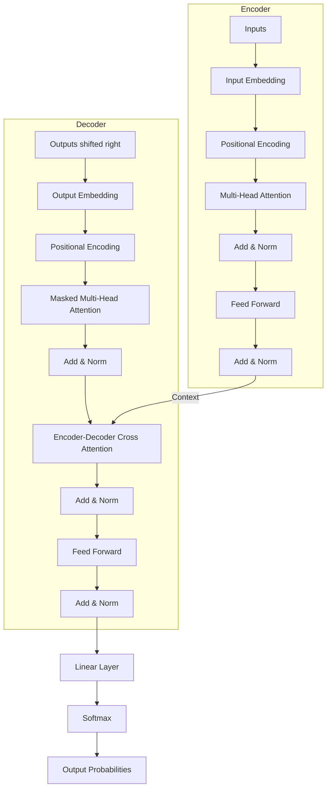

# Day 3: Transformer Architecture

## 1. Lesson Metadata
- **Lesson Title:** The Transformer Architecture
- **Duration:** 3 hours
- **Difficulty:** Advanced
- **Estimated Study Time:** 3 hours
- **Learning Objectives:**
  - Understand the macro-architecture of the original Transformer (Encoder-Decoder).
  - Explain how Positional Encoding injects sequence order into a parallel system.
  - Understand the role of Feed-Forward Neural Networks (FFNN) and Layer Normalization within the block.
  - Differentiate between Encoder-only (BERT), Decoder-only (GPT), and Encoder-Decoder (T5) architectures.
- **Prerequisites:** Completion of Day 2 (History of LMs).
- **Expected Outcomes:** You will be able to draw the Transformer block architecture from memory, explain the mathematical intuition behind positional encodings, and understand how modern LLMs are primarily Decoder-only variations of this original design.

---

## 2. Theory Section

### The Big Picture: Why Transformers?
Before 2017, sequence tasks (like translation) used Recurrent Neural Networks (RNNs) in an Encoder-Decoder setup. The Encoder processed the source sentence token by token into a single "context vector", and the Decoder generated the target sentence token by token. 
This created a bottleneck: all information from a long sentence had to be compressed into one fixed-size vector. The Transformer discarded recurrence entirely, relying on a mechanism called **Self-Attention** (covered deeply on Day 4) and processing all tokens in parallel.

### 1. The Input: Embeddings & Positional Encoding
Because Transformers process all tokens simultaneously (they don't read left-to-right), they have no inherent concept of word order. "Dog bites man" and "Man bites dog" would be processed identically without help.
- **Input Embeddings:** Converts tokens into dense vectors (like Word2Vec).
- **Positional Encoding:** We inject order by adding a mathematical signal to the embedding. The original paper uses sine and cosine functions of different frequencies. 
  - $PE_{(pos, 2i)} = sin(pos / 10000^{2i/d_{model}})$
  - $PE_{(pos, 2i+1)} = cos(pos / 10000^{2i/d_{model}})$
  - *Why Sin/Cos?* It allows the model to easily learn to attend to relative positions, as any position $PE_{pos+k}$ can be represented as a linear function of $PE_{pos}$.

### 2. The Encoder Block
The Encoder's job is to understand the input sequence perfectly and generate rich, contextualized representations.
Inside each Encoder block (usually stacked N=6 to 96 times):
1. **Multi-Head Self-Attention:** Figures out which words relate to which other words in the input.
2. **Add & Norm (Residual Connection + Layer Normalization):** Helps gradients flow during training (preventing vanishing gradients) and stabilizes the network.
3. **Feed-Forward Neural Network (FFNN):** A standard multi-layer perceptron applied to each position separately and identically. It expands the dimension (usually $4 \times d_{model}$), applies a non-linearity (like ReLU or GELU), and projects it back. This acts as the "memory" or "fact storage" of the network.
4. **Add & Norm:** Again, residual connection and normalization.

### 3. The Decoder Block
The Decoder's job is to generate the output sequence. It is autoregressive, meaning it predicts the next token, appends it to the input, and runs again.
Inside each Decoder block:
1. **Masked Multi-Head Self-Attention:** Similar to the encoder, but it is *masked*. The model is prevented from "looking into the future" at tokens it hasn't generated yet.
2. **Add & Norm.**
3. **Encoder-Decoder Cross-Attention:** Here, the Decoder looks at the final output of the Encoder to figure out what it should focus on from the original input sentence.
4. **Add & Norm.**
5. **Feed-Forward Network.**
6. **Add & Norm.**

### Evolution into Production Models
- **Encoder-only (BERT):** Excels at understanding text (classification, sentiment, NER). It cannot easily generate new text.
- **Decoder-only (GPT family, Llama, Claude):** Dropped the encoder entirely. Takes a prompt, processes it through masked attention, and generates the next token. 99% of modern Generative AI uses this.
- **Encoder-Decoder (T5, BART):** Used for tasks requiring heavy transformation, like translation or summarization.

---

## 3. Architecture Section

### The Transformer Macro-Architecture



---

## 4. Code Examples

Let's implement a conceptual Positional Encoding function in PyTorch to visualize how sequence order is mathematically injected into embeddings.

```python
"""
Filename: positional_encoding.py
Description: Generating and visualizing Positional Encodings.
"""
import torch
import math
import matplotlib.pyplot as plt

def get_positional_encoding(max_seq_len: int, d_model: int) -> torch.Tensor:
    """
    Generates sinusoidal positional encodings.
    max_seq_len: Maximum length of the sequence (e.g., 50 tokens).
    d_model: Dimensionality of the embedding vector (e.g., 128).
    """
    # Create an empty matrix of shape (max_seq_len, d_model)
    pe = torch.zeros(max_seq_len, d_model)
    
    # Create a vector of positions (0 to max_seq_len - 1)
    # Shape: (max_seq_len, 1)
    position = torch.arange(0, max_seq_len, dtype=torch.float).unsqueeze(1)
    
    # Calculate the divisor term: 10000^(2i/d_model)
    # Using log space for numerical stability
    div_term = torch.exp(torch.arange(0, d_model, 2).float() * (-math.log(10000.0) / d_model))
    
    # Apply sine to even indices (0, 2, 4...)
    pe[:, 0::2] = torch.sin(position * div_term)
    
    # Apply cosine to odd indices (1, 3, 5...)
    pe[:, 1::2] = torch.cos(position * div_term)
    
    return pe

# --- Execution ---
if __name__ == "__main__":
    seq_len = 100
    d_model = 128
    
    pe = get_positional_encoding(seq_len, d_model)
    
    print(f"Shape of Positional Encoding Matrix: {pe.shape}")
    print(f"Vector for Position 0 (First 5 dims): {pe[0, :5].numpy()}")
    print(f"Vector for Position 1 (First 5 dims): {pe[1, :5].numpy()}")
    
    # In a real model, this PE is ADDED to the Word Embeddings
    # x = embeddings(input) + pe[:input.size(1), :]
    
    # Visualization (Requires matplotlib)
    # plt.figure(figsize=(15, 5))
    # plt.pcolormesh(pe.numpy(), cmap='viridis')
    # plt.xlabel('Embedding Dimensions (d_model)')
    # plt.ylabel('Sequence Position (Tokens)')
    # plt.colorbar()
    # plt.title('Positional Encoding')
    # plt.show()
```

---

## 5. Hands-on Exercise

### Easy
**Task:** Run the Python script. Change `d_model` to 512 (the size used in the original paper) and `seq_len` to 2048 (the context window of GPT-3). Observe the tensor shape output.

### Medium
**Task:** Write a Python snippet that simulates the "Add" part of the "Add & Norm" step. Create a random tensor `x` (representing attention output) and a tensor `residual` (representing the original input). Add them together.

### Hard
**Task:** Implement a basic Feed-Forward Network layer in PyTorch as described in the Transformer paper: A Linear layer that expands `d_model` (e.g., 512) to $4 \times d_{model}$ (2048), a ReLU activation, and a second Linear layer that projects back to `d_model`.

---

## 6. Mini Assignment
**Simulate Residual Connections:**
Residual connections (skip connections) prevent the vanishing gradient problem. Write a conceptual script that proves a signal can bypass a non-linear layer entirely. 
Create an input value $X = 5.0$. Create a complex transformation function `F(x)` that returns `x * 0.01` (simulating a dead layer). Calculate the output with and without a residual connection (`Y = F(x)` vs `Y = F(x) + X`). 

**Expected Output:**
```text
Without Residual: Output = 0.05 (Signal is lost)
With Residual: Output = 5.05 (Signal is preserved)
```

---

## 7. Coding Challenge

**Problem Statement:**
Implement the mathematical logic of Layer Normalization for a single 1D vector (representing a token's embedding). Given a list of floats, calculate the mean and variance. Normalize the vector so it has a mean of 0 and a variance of 1. Finally, scale and shift the normalized vector using two learned parameters, $\gamma$ (gamma) and $\beta$ (beta). 
For this challenge, assume $\gamma = 2.0$ and $\beta = 0.5$. Add a small epsilon $\epsilon = 1e-5$ to the variance before taking the square root to prevent division by zero.

**Input:** A list of floats `x`.
**Output:** A list of floats representing the normalized, scaled, and shifted vector.

**Constraints:**
- Length of `x`: $2 \le len(x) \le 1000$

**Starter Code:**
```python
def layer_norm_1d(x: list[float]) -> list[float]:
    # Your code here
    pass
```

**Solution:**
```python
import math

def layer_norm_1d(x: list[float]) -> list[float]:
    n = len(x)
    
    # 1. Calculate Mean
    mean = sum(x) / n
    
    # 2. Calculate Variance
    variance = sum((val - mean) ** 2 for val in x) / n
    
    epsilon = 1e-5
    gamma = 2.0
    beta = 0.5
    
    # 3. Normalize, Scale, and Shift
    result = []
    for val in x:
        normalized = (val - mean) / math.sqrt(variance + epsilon)
        final_val = (normalized * gamma) + beta
        result.append(final_val)
        
    return result
```

**Hidden Test Cases:**
1. `layer_norm_1d([1.0, 2.0, 3.0])` -> `[-1.949, 0.5, 2.949]` (approx)
2. `layer_norm_1d([10.0, 10.0])` -> `[0.5, 0.5]` (since variance is 0, eps saves it, normalized is 0, + 0.5)

---

## 8. Quiz

1. **Why does the Transformer require Positional Encoding?**
   - A) To compress the size of the neural network.
   - B) Because it processes all tokens in parallel and inherently has no concept of sequence order.
   - C) To translate English into French.
   - D) To prevent the GPU from overheating.
   - **Correct Answer:** B
   - **Explanation:** Unlike RNNs which read word-by-word left-to-right, Transformers read the whole sentence at once. Without PE, "Dog bites man" and "Man bites dog" look exactly the same to the attention mechanism.

2. **What is the purpose of the Feed-Forward Neural Network (FFNN) inside the Transformer block?**
   - A) It calculates the attention scores.
   - B) It acts as a key-value memory store for facts, expanding the representation before projecting it back down.
   - C) It is responsible for tokenization.
   - D) It calculates the cosine similarity of words.
   - **Correct Answer:** B
   - **Explanation:** After attention determines "who looks at who", the FFNN (applied independently to each position) processes that contextualized information, effectively acting as the model's factual memory.

3. **What does the "Add" refer to in the "Add & Norm" step?**
   - A) Adding the vocabulary size to the input.
   - B) A Residual Connection (Skip Connection) where the original input to the sub-layer is added to its output.
   - C) Adding more layers to the network.
   - D) Adding bias to the weights.
   - **Correct Answer:** B
   - **Explanation:** Residual connections ($Output = F(x) + x$) allow gradients to flow directly through the network during backpropagation, solving the vanishing gradient problem.

4. **In the original Transformer, what connects the Encoder to the Decoder?**
   - A) A recurrent loop.
   - B) Cross-Attention.
   - C) Word2Vec.
   - D) Layer Normalization.
   - **Correct Answer:** B
   - **Explanation:** The Decoder uses Cross-Attention to look at the final outputs of the Encoder, determining which parts of the original input sentence are relevant to generating the next word.

5. **Which of the following models is an Encoder-only architecture?**
   - A) GPT-4
   - B) Llama 3
   - C) BERT
   - D) T5
   - **Correct Answer:** C
   - **Explanation:** BERT (Bidirectional Encoder Representations from Transformers) only uses the Encoder part, making it great for understanding text but poor for generating it.

6. **Why is the Self-Attention mechanism in the Decoder "Masked"?**
   - A) To protect user privacy.
   - B) To prevent the model from looking ahead at future tokens it hasn't generated yet during training.
   - C) To hide the positional encoding.
   - D) To reduce memory usage.
   - **Correct Answer:** B
   - **Explanation:** Since the decoder is autoregressive (predicting the *next* token), if it could see future tokens during training, it would "cheat" and simply copy them instead of learning to predict.

7. **How does Layer Normalization differ from Batch Normalization?**
   - A) It doesn't differ.
   - B) Batch Norm normalizes across the batch dimension for a specific feature; Layer Norm normalizes across all features for a specific sequence/token.
   - C) Layer Norm is only used in CNNs.
   - D) Layer Norm requires no learnable parameters.
   - **Correct Answer:** B
   - **Explanation:** In NLP, sequence lengths vary dynamically. Batch norm is unstable here. Layer Norm normalizes the embedding vector of an individual token, independent of the batch size.

8. **What mathematical functions were used for Positional Encoding in the original paper?**
   - A) Tangent and Cotangent.
   - B) Sine and Cosine of varying frequencies.
   - C) Logarithmic scales.
   - D) Purely random numbers.
   - **Correct Answer:** B
   - **Explanation:** Sine and Cosine waves of different frequencies allow the model to easily learn relative positions via linear transformations.

9. **If $d_{model}$ is 512, what is typically the intermediate hidden dimension of the Feed-Forward Network in the Transformer block?**
   - A) 128
   - B) 512
   - C) 2048
   - D) 4096
   - **Correct Answer:** C
   - **Explanation:** The standard Transformer architecture expands the dimension by a factor of 4 inside the FFNN ($512 \times 4 = 2048$) before projecting it back down.

10. **Modern Generative AI models (like ChatGPT and Claude) are primarily based on which part of the original Transformer?**
    - A) The Encoder.
    - B) The Positional Encoding only.
    - C) The Decoder.
    - D) The Cross-Attention mechanism.
    - **Correct Answer:** C
    - **Explanation:** Modern LLMs are almost exclusively Decoder-only architectures. They use masked self-attention to autoregressively predict the next token based on a prompt.

---

## 9. Flashcards

1. **Front:** Why do Transformers need Positional Encoding?
   **Back:** Because they process tokens in parallel; without PE, they have no concept of sequence order.
   **Difficulty:** Easy

2. **Front:** What is the purpose of the Residual Connection (the "Add" in Add & Norm)?
   **Back:** To prevent the vanishing gradient problem by allowing an unobstructed path for gradients during backpropagation.
   **Difficulty:** Medium

3. **Front:** What does the Decoder do that the Encoder does not?
   **Back:** It uses Masked Attention (preventing looking into the future) and Autoregressive generation (predicting one token at a time).
   **Difficulty:** Medium

4. **Front:** Is BERT an Encoder or Decoder?
   **Back:** Encoder-only.
   **Difficulty:** Easy

5. **Front:** Are GPT models Encoders or Decoders?
   **Back:** Decoder-only.
   **Difficulty:** Easy

6. **Front:** What mathematical functions generate Positional Encodings in the original paper?
   **Back:** Sine and Cosine.
   **Difficulty:** Medium

7. **Front:** What is Cross-Attention?
   **Back:** The mechanism in the Decoder that allows it to look back at the outputs of the Encoder.
   **Difficulty:** Hard

8. **Front:** Why use Layer Normalization instead of Batch Normalization in Transformers?
   **Back:** Because sequence lengths vary, making Batch Norm unstable across batches. Layer Norm normalizes across the feature dimension of a single token.
   **Difficulty:** Hard

9. **Front:** By what factor does the FFNN typically expand the $d_{model}$ dimension?
   **Back:** A factor of 4 (e.g., 512 expands to 2048).
   **Difficulty:** Medium

10. **Front:** What does "Autoregressive" mean in the context of LLMs?
    **Back:** Generating output sequentially, where each predicted token is appended to the input to predict the subsequent token.
    **Difficulty:** Easy

---

## 10. Interview Questions

### Beginner
**Q: Can you draw or describe the high-level components of a standard Transformer block?**
**Ideal Answer:** A standard Encoder block takes an input, adds positional encoding, and passes it through Multi-Head Self-Attention. The output goes through an Add (residual connection) and Norm (layer normalization). Then, it passes through a Feed-Forward Neural Network, followed by another Add & Norm.

### Intermediate
**Q: Explain the difference between Encoder-only, Decoder-only, and Encoder-Decoder architectures. Give an example of each.**
**Ideal Answer:** Encoder-only models (like BERT) process text bidirectionally to deeply understand context, making them great for classification but bad at generation. Decoder-only models (like GPT-3) process text autoregressively with masked attention (only looking at past tokens) and excel at generation. Encoder-Decoder models (like T5) use both, making them ideal for sequence-to-sequence tasks like translation where the input is highly structured and must map to a complex output.

### Advanced
**Q: The Feed-Forward Network in a Transformer seems redundant after Self-Attention. What is its mathematical and practical purpose?**
**Ideal Answer:** While Self-Attention aggregates context (routing information between tokens), it is purely a linear transformation (a weighted sum of value vectors). It doesn't process the *content* deeply. The FFNN applies non-linearity (ReLU/GELU) independently to each position's vector. Research suggests the FFNN acts as the model's factual memory store, mapping the contextualized representation to a higher-dimensional space to recall stored concepts before projecting it back down.

### HR-style / Conceptual
**Q: In your opinion, why did the industry converge almost entirely on Decoder-only models for Generative AI, abandoning the Encoder?**
**Ideal Answer:** It comes down to scale and simplicity. OpenAI proved with GPT-2 and GPT-3 that if you scale a Decoder-only model massively, its representation learning becomes so good that it effectively acts as an encoder anyway. By dropping the Encoder, you halve the architectural complexity, remove the need for cross-attention, and optimize your entire engineering pipeline for one task: autoregressive next-token prediction, which GPUs can compute incredibly efficiently.

---

## 11. Resources
- **Research Papers:** 
  - "Attention Is All You Need" (Vaswani et al., 2017)
  - "Language Models are Unsupervised Multitask Learners" (GPT-2, Radford et al., 2019)
- **Blogs:** "The Illustrated Transformer" by Jay Alammar (Mandatory reading for visualizing the architecture).
- **GitHub:** The original PyTorch implementation of the Transformer in `torch.nn.Transformer`.
- **YouTube:** "Transformer Neural Networks - EXPLAINED!" by StatQuest.

---

## 12. Real World Engineering
### How Top Tech Companies Implement Transformers
- **Memory Walls (NVIDIA/CoreWeave):** The actual math of a Transformer is simple. The engineering nightmare is memory bandwidth. Moving the massive weights of the FFNN from GPU High-Bandwidth Memory (HBM) to the compute cores takes longer than the math itself. Production systems focus heavily on memory optimization.
- **The Context Window Problem:** Positional Encodings were originally static (up to 2048 tokens). Modern engineering (like at Anthropic with Claude) uses **RoPE (Rotary Positional Embeddings)** instead of absolute Sine/Cosine encodings. RoPE encodes absolute position with a rotation matrix and naturally captures relative position, allowing models to scale to 1,000,000+ token context windows.
- **Serving at Scale (vLLM):** In production, running a standard autoregressive loop is slow because you generate one token at a time. Frameworks like vLLM use "PagedAttention", which treats KV-caches (the saved attention states of past tokens) like virtual memory in an operating system, paging them in and out of GPU RAM to serve hundreds of users simultaneously on a single GPU.
