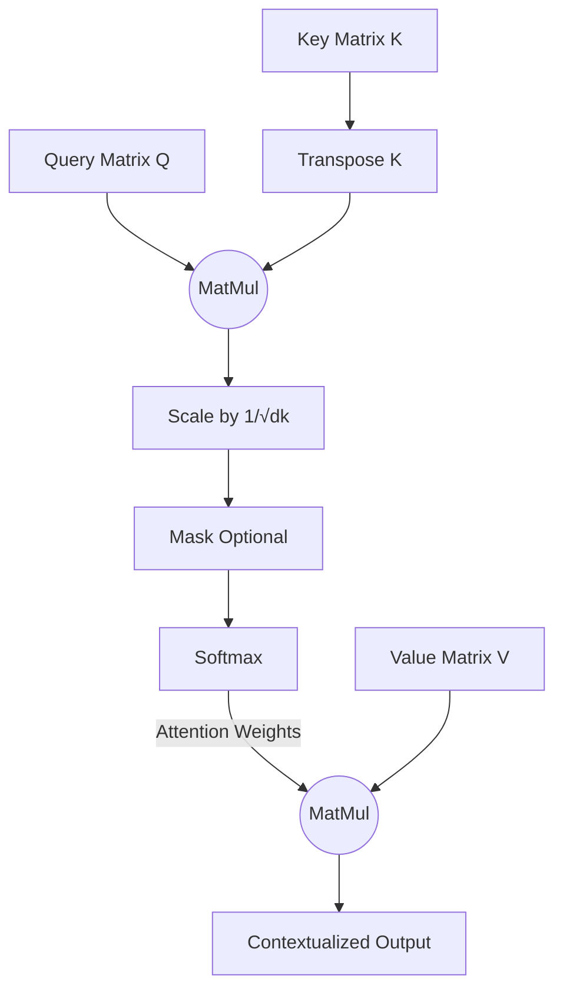
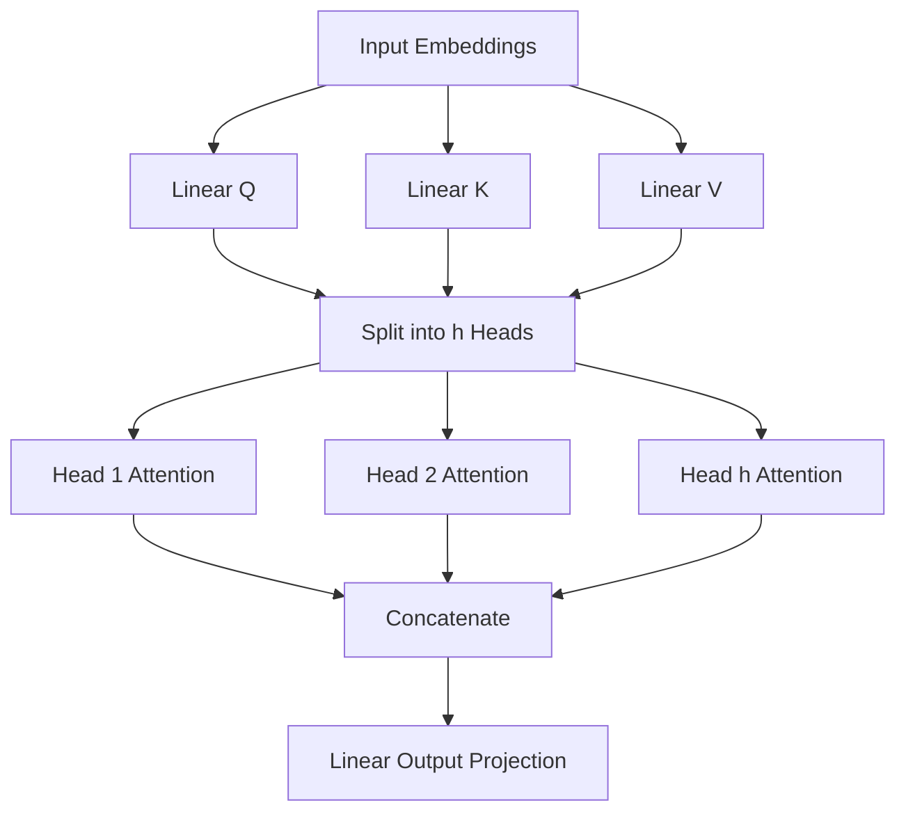

# Day 4: Attention Mechanism

## 1. Lesson Metadata
- **Lesson Title:** The Attention Mechanism (Self & Multi-Head)
- **Duration:** 3 hours
- **Difficulty:** Advanced
- **Estimated Study Time:** 3 hours
- **Learning Objectives:**
  - Understand the intuition behind the Query, Key, and Value (QKV) paradigm.
  - Mathematically calculate Scaled Dot-Product Attention.
  - Explain why scaling the dot product is necessary for softmax stability.
  - Understand how Multi-Head Attention allows a model to focus on different linguistic features simultaneously.
- **Prerequisites:** Completion of Day 3 (Transformer Architecture), basic Linear Algebra (dot products, matrix multiplication).
- **Expected Outcomes:** You will be able to code the core self-attention equation from scratch and explain exactly how a Transformer routes information dynamically between tokens.

---

## 2. Theory Section

### The Core Intuition: The Database Retrieval Analogy
To understand Attention, think of a database.
When you search a database, you submit a **Query** (what you are looking for). The database compares your Query against the **Keys** (the indexed metadata of all entries). If a Key matches your Query, the database returns the corresponding **Value** (the actual data).

In Self-Attention, *every token acts as all three*.
When processing the sentence "The bank of the river":
- The word "bank" generates a **Query**: "I am a noun, I need to know my context (is it money or water?)."
- The word "river" generates a **Key**: "I am a body of water."
- The **Query** of "bank" is compared to the **Key** of "river". Because they are highly related, the attention score is high.
- Therefore, the **Value** of "river" is strongly mixed into the new contextualized representation of "bank". Now, the network knows this is a water bank.

### The Math: Scaled Dot-Product Attention
The core equation of the Transformer is:
$$ Attention(Q, K, V) = softmax\left(\frac{QK^T}{\sqrt{d_k}}\right)V $$

1. **Dot Product ($QK^T$):** We multiply the Query matrix by the transposed Key matrix. The dot product of two vectors measures their similarity. High dot product = highly related tokens.
2. **Scale ($\sqrt{d_k}$):** As the dimension of the vectors ($d_k$) grows, the dot products get very large. Large numbers push the Softmax function into regions with extremely small gradients (vanishing gradients). We divide by $\sqrt{d_k}$ to stabilize the variance to 1.
3. **Softmax:** Converts the raw scores into a probability distribution that sums to 1. E.g., Token 1 might pay 80% attention to Token 3, 10% to Token 2, and 10% to itself.
4. **Multiply by Value ($V$):** We multiply the softmax probabilities by the Value matrix. This acts as a routing mechanism. If the probability is near 0, that token's value is ignored. If it's near 1, that token's value heavily influences the output.

### Multi-Head Attention (MHA)
Why have just one attention mechanism? Language is complex. In the sentence "The boy threw the red ball", the word "threw" needs to attend to "boy" (who did the throwing) and "ball" (what was thrown).
Instead of computing one large attention, the model splits the Q, K, and V matrices into $h$ smaller "heads" (e.g., 8 or 12 heads). 
- Head 1 might focus on Subject-Verb relationships.
- Head 2 might focus on Adjective-Noun relationships.
- Head 3 might track pronoun references.
All heads compute attention independently in parallel, their outputs are concatenated, and then passed through a final linear projection.

### Self-Attention vs Cross-Attention
- **Self-Attention:** Q, K, and V all come from the exact same source (e.g., the input sentence). "Tokens looking at other tokens in their own sequence."
- **Cross-Attention (in Decoders):** Q comes from the Decoder (the output being generated), while K and V come from the Encoder (the original input sentence). "The translation looking back at the original text."

---

## 3. Architecture Section

### Scaled Dot-Product Attention Flow



### Multi-Head Attention



---

## 4. Code Examples

Let's implement the Scaled Dot-Product Attention equation in pure PyTorch to see the math in action.

```python
"""
Filename: self_attention_demo.py
Description: Implementing Scaled Dot-Product Attention from scratch.
"""
import torch
import torch.nn.functional as F
import math

def scaled_dot_product_attention(q: torch.Tensor, k: torch.Tensor, v: torch.Tensor, mask=None):
    """
    Computes scaled dot-product attention.
    Shapes:
        q, k, v: (batch_size, sequence_length, d_k)
    """
    d_k = q.size(-1)
    
    # 1. MatMul: Q * K^T
    # q is (B, Seq, d_k). k.transpose(-2, -1) is (B, d_k, Seq)
    # scores shape: (B, Seq, Seq)
    scores = torch.matmul(q, k.transpose(-2, -1))
    
    # 2. Scale
    scores = scores / math.sqrt(d_k)
    
    # 3. Mask (Optional - used in Decoder)
    if mask is not None:
        # Fill masked positions (where mask == 0) with a very large negative number
        # so that softmax probability becomes 0.
        scores = scores.masked_fill(mask == 0, -1e9)
        
    # 4. Softmax
    # Applies softmax over the last dimension (the keys)
    attention_weights = F.softmax(scores, dim=-1)
    
    # 5. Multiply by V
    # attention_weights is (B, Seq, Seq), v is (B, Seq, d_k)
    # output shape: (B, Seq, d_k)
    output = torch.matmul(attention_weights, v)
    
    return output, attention_weights

# --- Execution ---
if __name__ == "__main__":
    # Simulate a batch of 1, sequence length of 3 (e.g., "The bank river"), d_k of 4
    batch_size = 1
    seq_len = 3
    d_k = 4
    
    # Normally, these are created by passing embeddings through Linear layers.
    # For simulation, we'll use random tensors.
    torch.manual_seed(42)
    Q = torch.rand(batch_size, seq_len, d_k)
    K = torch.rand(batch_size, seq_len, d_k)
    V = torch.rand(batch_size, seq_len, d_k)
    
    output, attn_weights = scaled_dot_product_attention(Q, K, V)
    
    print("--- Attention Weights (Probabilities) ---")
    # This shows how much each of the 3 tokens attends to the other 3 tokens
    print(attn_weights.squeeze().numpy())
    
    print("\n--- Contextualized Output ---")
    print(output.squeeze().numpy())
```

---

## 5. Hands-on Exercise

### Easy
**Task:** Run the Python script. Analyze the `attn_weights` matrix. Verify that each row sums to exactly 1.0 (or very close to it due to floating-point precision). Why must the rows sum to 1?

### Medium
**Task:** Create a causal mask. In the Decoder, the mask prevents looking into the future. A causal mask for a sequence of length 3 looks like a lower triangular matrix:
```
[[1, 0, 0],
 [1, 1, 0],
 [1, 1, 1]]
```
Create this mask using `torch.tril` and pass it to the `scaled_dot_product_attention` function. Observe how the top-right triangle of the attention weights becomes exactly 0.0.

### Hard
**Task:** Write a wrapper class `MultiHeadAttention` in PyTorch. It should instantiate 3 `nn.Linear` layers to project the raw input into Q, K, and V. Assume `d_model=128` and `num_heads=8`. You don't need to actually perform the complex tensor reshaping for heads, just write the `__init__` and outline the `forward` pass structure.

---

## 6. Mini Assignment
**Calculate Softmax Stability manually:**
Write a Python script that takes two random vectors of size 1000. Calculate their dot product. 
1. Pass the raw dot product to a sigmoid/softmax-like function (e.g., $1 / (1 + e^{-x})$).
2. Divide the dot product by $\sqrt{1000}$ and pass it to the same function.
Print the results. Observe how the raw dot product usually yields exactly 1.0 or 0.0 (killing gradients), while the scaled version yields a number between 0 and 1, preserving gradient flow.

---

## 7. Coding Challenge

**Problem Statement:**
Implement a simplified causal mask generator. Given an integer `seq_len`, return a 2D list of lists representing a boolean causal mask (True to keep, False to mask).
The matrix should be a lower triangular matrix. Elements on and below the main diagonal should be `True`. Elements above the main diagonal (representing future tokens) should be `False`.

**Input:** An integer `seq_len` ($1 \le seq\_len \le 1000$).
**Output:** A 2D list of booleans of size `seq_len` $\times$ `seq_len`.

**Constraints:**
- Use pure Python (no NumPy or PyTorch).

**Starter Code:**
```python
def generate_causal_mask(seq_len: int) -> list[list[bool]]:
    # Your code here
    pass
```

**Solution:**
```python
def generate_causal_mask(seq_len: int) -> list[list[bool]]:
    mask = []
    for i in range(seq_len):
        row = []
        for j in range(seq_len):
            # Keep if column index (j) is <= row index (i)
            if j <= i:
                row.append(True)
            else:
                row.append(False)
        mask.append(row)
    return mask
```

**Hidden Test Cases:**
1. `generate_causal_mask(1)` -> `[[True]]`
2. `generate_causal_mask(3)` -> `[[True, False, False], [True, True, False], [True, True, True]]`

---

## 8. Quiz

1. **In the Self-Attention mechanism, what do Q, K, and V stand for?**
   - A) Quality, Knowledge, Vector
   - B) Query, Key, Value
   - C) Quantity, K-means, Variance
   - D) Queue, Kernel, Variable
   - **Correct Answer:** B
   - **Explanation:** Drawn from database retrieval concepts, Query represents what the token is looking for, Key represents what the token contains, and Value represents the actual payload to be extracted.

2. **Why do we scale the dot product by dividing by $\sqrt{d_k}$?**
   - A) To compress the model size on disk.
   - B) To increase the learning rate dynamically.
   - C) To prevent the dot product from growing too large, which pushes the softmax function into regions with extremely small gradients.
   - D) To translate the output into probabilities.
   - **Correct Answer:** C
   - **Explanation:** For large dimensions, dot products can yield massive values. Softmax of [1000, 10] becomes exactly [1, 0]. Scaling keeps the variance near 1, keeping gradients healthy.

3. **In Self-Attention, where do the Query, Key, and Value matrices come from?**
   - A) The Query comes from the user prompt; Key and Value come from the database.
   - B) They are all derived by applying three separate Linear transformations to the exact same input embedding.
   - C) They are hardcoded and never updated during training.
   - D) Query comes from the Decoder, Key/Value from the Encoder.
   - **Correct Answer:** B
   - **Explanation:** In *Self*-Attention, the input token sequence is linearly projected three different ways to form its own Q, K, and V.

4. **What is the shape of the Attention Weights matrix output by the Softmax function?**
   - A) (Sequence Length, Model Dimension)
   - B) (Model Dimension, Model Dimension)
   - C) (Sequence Length, Sequence Length)
   - D) (Batch Size, 1)
   - **Correct Answer:** C
   - **Explanation:** The attention matrix dictates how much every token in the sequence attends to every other token in the sequence, hence an $N \times N$ matrix.

5. **What is the primary benefit of Multi-Head Attention over Single-Head Attention?**
   - A) It runs much faster on CPUs.
   - B) It allows the model to jointly attend to information from different representation subspaces (e.g., one head for syntax, one for semantics).
   - C) It reduces the memory footprint of the model.
   - D) It prevents hallucination completely.
   - **Correct Answer:** B
   - **Explanation:** Multiple heads allow the model to learn diverse features simultaneously, rather than being forced to average all relational information into a single representation.

6. **In the Transformer Decoder, why is a mask applied to the Self-Attention mechanism?**
   - A) To prevent the model from looking at future tokens, ensuring it learns to autoregressively predict the next word.
   - B) To hide personally identifiable information.
   - C) To stop the gradients from exploding.
   - D) To ignore padding tokens.
   - **Correct Answer:** A
   - **Explanation:** Masking sets the attention scores for future tokens to $-\infty$. After softmax, this becomes $0$ probability, enforcing the causal structure of generation.

7. **How does Cross-Attention differ from Self-Attention in the original Transformer?**
   - A) There is no difference.
   - B) Cross-attention uses addition instead of dot products.
   - C) In Cross-Attention, the Query comes from the Decoder, but the Keys and Values come from the Encoder.
   - D) Cross-Attention only uses one head.
   - **Correct Answer:** C
   - **Explanation:** The Decoder is trying to figure out which parts of the original input sentence (Encoder output -> Keys/Values) are most relevant to the word it is currently generating (Decoder state -> Query).

8. **If `seq_len` is 1024, what is the size of the attention matrix that must be computed, and why is this an engineering bottleneck?**
   - A) 1024; scales linearly.
   - B) $1024 \times 1024$ (over 1 million elements); memory scales quadratically $O(N^2)$ with sequence length.
   - C) 512; it's halved.
   - D) 1024 * dimension.
   - **Correct Answer:** B
   - **Explanation:** Self-attention compares every token to every other token. A 1M token context window requires calculating a $1,000,000 \times 1,000,000$ matrix, requiring immense GPU memory.

9. **If the raw dot product score between Token A and Token B is $-\infty$, what will their attention weight be after the Softmax function?**
   - A) $-\infty$
   - B) 1.0
   - C) 0.0
   - D) $-1.0$
   - **Correct Answer:** C
   - **Explanation:** Softmax converts $-\infty$ (or massive negative numbers) to exactly 0. This is the mathematical basis of masking.

10. **Which matrix operation routes the final information based on the attention probabilities?**
    - A) Multiplying the attention weights by the Query matrix.
    - B) Multiplying the attention weights by the Key matrix.
    - C) Multiplying the attention weights by the Value matrix.
    - D) Adding the attention weights to the Input.
    - **Correct Answer:** C
    - **Explanation:** Once the Softmax gives the probabilities (routing instructions), we multiply by the Value matrix to extract the actual contextual information.

---

## 9. Flashcards

1. **Front:** In the QKV paradigm, which vector represents "what a token is looking for"?
   **Back:** The Query (Q) vector.
   **Difficulty:** Easy

2. **Front:** Write the core Scaled Dot-Product Attention equation.
   **Back:** $Attention(Q, K, V) = softmax(\frac{QK^T}{\sqrt{d_k}})V$
   **Difficulty:** Hard

3. **Front:** Why divide the dot product by $\sqrt{d_k}$?
   **Back:** To stabilize variance and prevent the softmax function from outputting near-zero gradients.
   **Difficulty:** Medium

4. **Front:** What is the shape of an Attention Score matrix?
   **Back:** (Sequence Length) x (Sequence Length) - i.e., $N \times N$.
   **Difficulty:** Medium

5. **Front:** What is the purpose of Multi-Head Attention?
   **Back:** Allows the model to attend to multiple different linguistic subspaces simultaneously (e.g., grammar, tone, semantics).
   **Difficulty:** Easy

6. **Front:** How is a causal mask implemented mathematically in the attention function?
   **Back:** By filling the upper triangle of the raw score matrix with a massive negative number (like $-1e9$) before applying softmax.
   **Difficulty:** Medium

7. **Front:** In Cross-Attention, where does the Query matrix come from?
   **Back:** The Decoder (the sequence currently being generated).
   **Difficulty:** Medium

8. **Front:** In Self-Attention, where do Q, K, and V come from?
   **Back:** They are all linearly projected from the exact same input sequence.
   **Difficulty:** Easy

9. **Front:** What is the Big O memory complexity of standard Self-Attention with respect to sequence length $N$?
   **Back:** $O(N^2)$ - Quadratic scaling.
   **Difficulty:** Medium

10. **Front:** What matrix actually holds the "content" that gets aggregated and passed to the next layer?
    **Back:** The Value (V) matrix.
    **Difficulty:** Easy

---

## 10. Interview Questions

### Beginner
**Q: Explain the concept of Attention using the Query, Key, Value analogy.**
**Ideal Answer:** Imagine going to a library. Your search query (Query) is compared against the titles on the books (Keys). The books whose titles best match your query are pulled off the shelf, and you read their contents (Values). In Self-Attention, every word in a sentence acts as a search query, a book title, and book content simultaneously to figure out the context of the sentence.

### Intermediate
**Q: Explain the mathematical necessity of the scaling factor in Scaled Dot-Product Attention.**
**Ideal Answer:** The dot product of two vectors of dimension $d$ has a variance that grows with $d$. If $d$ is large (like 64 or 128), the dot products can result in very large positive or negative numbers. When fed into a Softmax function, large inputs cause the output probabilities to become extremely sharp (closer to 1 or 0), which pushes the gradients near zero. Dividing by the square root of $d$ normalizes the variance back to 1, keeping the model in the healthy gradient regime during training.

### Advanced
**Q: Standard Self-Attention memory scales quadratically, $O(N^2)$. How do modern architectures mitigate this to achieve 1-million token context windows?**
**Ideal Answer:** Standard self-attention calculates the full $N \times N$ matrix. To bypass this, researchers developed Sparse Attention (only looking at a sliding window of local tokens), Ring Attention (distributing the sequence across multiple GPUs), and FlashAttention. FlashAttention doesn't change the math, but it is an IO-aware algorithm that fuses the QKV computation into a single kernel, avoiding writing the massive intermediate $N \times N$ matrix to the GPU's slow HBM (High Bandwidth Memory), keeping it in the fast SRAM instead.

### HR-style / Conceptual
**Q: You notice our model is paying too much attention to punctuation marks and ignoring the subject of sentences. How would you investigate this?**
**Ideal Answer:** This sounds like an issue with the attention weights. I would extract the raw attention matrices from the heads of the trained model and visualize them using heatmaps to confirm the hypothesis. If true, it could be a tokenization issue (punctuation being over-represented) or a training data imbalance. I might experiment with custom attention masking to penalize punctuation, or review the pre-training dataset's quality.

---

## 11. Resources
- **Research Papers:** 
  - "Attention Is All You Need" (Vaswani et al., 2017)
  - "FlashAttention: Fast and Memory-Efficient Exact Attention with IO-Awareness" (Dao et al., 2022) - Highly recommended for Advanced LLMOps engineers.
- **YouTube:** "Attention in neural networks and how it works" by 3Blue1Brown (The absolute best visual intuition available).
- **GitHub:** Hugging Face `transformers` source code for `modeling_llama.py` (to see attention implemented in modern models).

---

## 12. Real World Engineering
### How Top Tech Companies Implement Attention in Production
- **FlashAttention (NVIDIA/Together AI):** Written by Tri Dao, FlashAttention is arguably the most important engineering breakthrough in LLMs since the Transformer itself. In PyTorch, doing MatMul -> Softmax -> MatMul requires writing huge intermediate tensors to VRAM. FlashAttention writes a custom CUDA kernel that does the entire block in the ultra-fast L1 SRAM on the GPU. If you are serving LLMs in production, you MUST ensure your inference engine (like vLLM or TGI) has FlashAttention enabled.
- **Multi-Query Attention (MQA) / Grouped-Query Attention (GQA):** Standard Multi-Head Attention requires saving the Keys and Values for every single head during generation (the KV-Cache). For a large batch size, this consumes all GPU VRAM instantly. Google (PaLM) and Meta (Llama 2/3) use GQA. Instead of creating $h$ different Key and Value matrices, they share a single Key/Value matrix across multiple Query heads. This drastically reduces the size of the KV-Cache, allowing for much higher throughput and concurrency at the cost of very minor accuracy drops.
- **Sliding Window Attention (Mistral):** Instead of calculating the full $N \times N$ matrix for 100k tokens, Mistral restricts attention to a local window (e.g., 4096 tokens). Because layers are stacked, layer 2 looks at 4k tokens, but those tokens looked at 4k tokens in layer 1, creating a massive *receptive field* without the $O(N^2)$ computational penalty.
