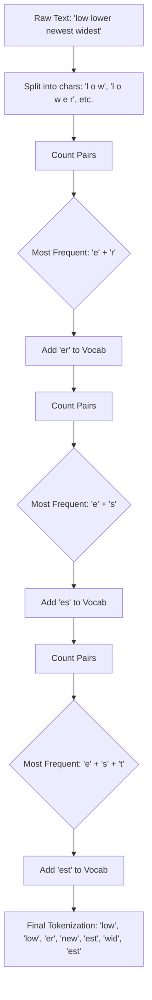

# Day 5: Tokenization

## 1. Lesson Metadata
- **Lesson Title:** Tokenization & Vocabulary Building
- **Duration:** 2-3 hours
- **Difficulty:** Intermediate
- **Estimated Study Time:** 2.5 hours
- **Learning Objectives:**
  - Understand why word-level and character-level tokenization fail in production.
  - Explain subword tokenization algorithms: Byte-Pair Encoding (BPE), WordPiece, and SentencePiece.
  - Understand the concept of Out-Of-Vocabulary (OOV) tokens and how subword tokenization solves it.
  - Learn the role of Special Tokens (`<EOS>`, `<BOS>`, `[MASK]`, `<|im_start|>`).
- **Prerequisites:** Completion of Day 4.
- **Expected Outcomes:** You will be able to write a basic BPE algorithm from scratch and explain why modern LLMs use BPE/SentencePiece over traditional splitting methods.

---

## 2. Theory Section

### The Problem: How do neural networks read?
Neural networks only understand numbers. To feed text into a Transformer, we must split the text into chunks, assign an integer ID to each chunk, and look up its embedding vector. This splitting process is called **Tokenization**.

### Early Attempts and their Failures
1. **Character-Level Tokenization:** 
   - *How:* Split "hello" into `['h', 'e', 'l', 'l', 'o']`.
   - *Pros:* Tiny vocabulary size (approx 256 characters/bytes). No Out-Of-Vocabulary (OOV) issues.
   - *Cons:* Characters hold very little semantic meaning. The sequence length becomes massive (a 1,000-word essay becomes 5,000+ tokens). Since Transformer memory scales $O(N^2)$, character-level models crash GPUs quickly.
2. **Word-Level Tokenization:**
   - *How:* Split on spaces. "I love coding!" -> `['I', 'love', 'coding!']`.
   - *Pros:* High semantic meaning per token. Short sequence lengths.
   - *Cons:* Massive vocabulary size. If the model encounters a typo ("codng") or a new word ("ChatGPT"), it crashes or assigns an `<UNK>` (Unknown) token. Punctuation sticks to words, creating redundancy ("hello", "hello,", "hello!").

### The Solution: Subword Tokenization
Subword tokenization finds the sweet spot. Frequent words are kept as whole words ("apple"). Rare words are broken down into meaningful subwords ("unbelievably" -> "un", "believ", "ably").
- *Solves OOV:* Any unknown word can be constructed from its smaller subwords or characters.
- *Reduces sequence length:* Better than character-level.
- *Manages vocabulary size:* Usually kept between 32k and 128k tokens.

### Byte-Pair Encoding (BPE)
BPE is the algorithm used by the GPT family (GPT-2, GPT-3, GPT-4, Llama).
1. Initialize the vocabulary with all single characters (or bytes).
2. Count the frequencies of adjacent pairs.
3. Merge the most frequent pair into a new single token.
4. Add the new token to the vocabulary.
5. Repeat until you reach the target vocabulary size.

### WordPiece & SentencePiece
- **WordPiece:** Developed by Google, used in BERT. Similar to BPE, but instead of merging the most frequent pair, it merges the pair that maximizes the likelihood of the training data. Uses `##` to denote subwords that attach to previous words (e.g., `['run', '##ning']`).
- **SentencePiece:** Unlike BPE/WordPiece which assume spaces separate words, SentencePiece treats the input as a raw stream of characters, including spaces (represented by `_` or ` `). This is crucial for languages without spaces (like Chinese or Japanese). Used in T5 and Llama.

### Special Tokens
Models use special tokens as structural markers.
- `<BOS>` / `<s>`: Beginning of Sequence.
- `<EOS>` / `</s>`: End of Sequence (tells the model to stop generating).
- `<PAD>`: Padding token (used to make all sequences in a batch the same length).
- `[MASK]`: Used in BERT for masked language modeling.
- Chat markup: Modern instruct models use tokens like `<|im_start|>user\n` and `<|im_end|>` to delineate conversation turns.

---

## 3. Architecture Section

### Byte-Pair Encoding (BPE) Merge Process



---

## 4. Code Examples

Let's write a simplified Byte-Pair Encoding (BPE) trainer from scratch.

```python
"""
Filename: basic_bpe.py
Description: A simple implementation of the Byte-Pair Encoding training algorithm.
"""
from collections import defaultdict
import re

def get_stats(vocab):
    """Counts frequency of adjacent symbol pairs in the vocabulary."""
    pairs = defaultdict(int)
    for word, freq in vocab.items():
        symbols = word.split()
        for i in range(len(symbols) - 1):
            pairs[symbols[i], symbols[i+1]] += freq
    return pairs

def merge_vocab(pair, v_in):
    """Merges the most frequent pair in all vocabulary words."""
    v_out = {}
    # Regex to find the exact pair separated by space
    bigram = re.escape(' '.join(pair))
    p = re.compile(r'(?<!\S)' + bigram + r'(?!\S)')
    
    for word in v_in:
        # Replace the space-separated pair with the merged pair
        w_out = p.sub(''.join(pair), word)
        v_out[w_out] = v_in[word]
    return v_out

# --- Execution ---
if __name__ == "__main__":
    # 1. Initialize vocabulary with characters separated by spaces, plus an end-of-word marker </w>
    # The dictionary value is the frequency of the word in our imaginary corpus.
    vocab = {
        'l o w </w>': 5, 
        'l o w e r </w>': 2, 
        'n e w e s t </w>': 6, 
        'w i d e s t </w>': 3
    }
    
    num_merges = 10
    
    print("--- Original Vocabulary ---")
    for k, v in vocab.items(): print(f"{k}: {v}")
    
    for i in range(num_merges):
        pairs = get_stats(vocab)
        if not pairs:
            break
            
        # Find the pair with the highest frequency
        best = max(pairs, key=pairs.get)
        print(f"\nStep {i+1}: Merging pair {best} (Freq: {pairs[best]})")
        
        # Merge that pair in the vocabulary
        vocab = merge_vocab(best, vocab)
        
        print("Updated Vocab:")
        for k, v in vocab.items(): print(f"{k}: {v}")
```

---

## 5. Hands-on Exercise

### Easy
**Task:** Run the Python script. Change the `num_merges` to 3. Observe the output. Which pairs are merged first? Why is `e s` merged before `e r`?

### Medium
**Task:** Modify the initial vocabulary to include: `'u n b e l i e v a b l e </w>': 10`, `'b e l i e v e </w>': 15`. Run the script. What common subword emerges from the merges?

### Hard
**Task:** `tiktoken` is OpenAI's open-source BPE tokenizer. Install it (`pip install tiktoken`). Write a Python script that loads the `cl100k_base` encoding (used by GPT-4). Tokenize the string `"I cannot unbelieve this!"` and print both the integer IDs and the decoded string representation of each individual token.

---

## 6. Mini Assignment
**Calculate Token Math:**
Tokens dictate pricing in LLM APIs (e.g., $10 per 1M tokens). A standard rule of thumb for English is that 1 token ≈ 0.75 words.
Write a script that takes an integer representing a word count (e.g., 500,000 words). Calculate the estimated number of tokens. Calculate the cost to process this text using an API that charges $15.00 per 1 million input tokens.

**Expected Output (for 500k words):**
```text
Words: 500,000
Estimated Tokens: 666,666
Total Cost: $10.00
```

---

## 7. Coding Challenge

**Problem Statement:**
Implement a padding function. In LLM batch processing, all sequences in a batch must have the same length. You are given a list of lists of integers (representing token IDs). You need to pad them to match the length of the longest sequence in the batch using a `pad_token_id`. If `padding_side` is 'right', append the pad tokens at the end. If 'left', prepend them.

**Input:** 
- `batch`: A list of lists of integers.
- `pad_token_id`: An integer (default 0).
- `padding_side`: A string, either `'left'` or `'right'`.

**Output:** A list of lists of integers, all of the same length.

**Constraints:**
- Length of batch: $1 \le len(batch) \le 100$

**Starter Code:**
```python
def pad_sequences(batch: list[list[int]], pad_token_id: int = 0, padding_side: str = 'right') -> list[list[int]]:
    # Your code here
    pass
```

**Solution:**
```python
def pad_sequences(batch: list[list[int]], pad_token_id: int = 0, padding_side: str = 'right') -> list[list[int]]:
    max_len = max(len(seq) for seq in batch)
    padded_batch = []
    
    for seq in batch:
        pad_length = max_len - len(seq)
        padding = [pad_token_id] * pad_length
        
        if padding_side == 'right':
            padded_batch.append(seq + padding)
        else:
            padded_batch.append(padding + seq)
            
    return padded_batch
```

**Hidden Test Cases:**
1. `pad_sequences([[1, 2], [3]], pad_token_id=0, padding_side='right')` -> `[[1, 2], [3, 0]]`
2. `pad_sequences([[1, 2], [3]], pad_token_id=9, padding_side='left')` -> `[[1, 2], [9, 3]]`

---

## 8. Quiz

1. **Why is Character-Level tokenization rarely used in LLMs?**
   - A) Characters cannot be converted to integers.
   - B) It creates massive sequence lengths, which crashes the $O(N^2)$ attention mechanism.
   - C) It requires too much disk space.
   - D) It causes massive Out-Of-Vocabulary (OOV) errors.
   - **Correct Answer:** B
   - **Explanation:** Character models result in very long sequences. Because transformer memory scales quadratically with sequence length, this is highly inefficient.

2. **What is an Out-Of-Vocabulary (OOV) token?**
   - A) A token reserved for punctuation.
   - B) A token that tells the model to stop generating.
   - C) A word the model encounters that was not in its training vocabulary, often resulting in an `<UNK>` tag.
   - D) A token used for padding.
   - **Correct Answer:** C
   - **Explanation:** In strict word-level tokenization, if the model hasn't seen the exact string before, it maps it to an Unknown (OOV) token, losing all semantic meaning.

3. **How does Subword Tokenization solve the OOV problem?**
   - A) By ignoring words it doesn't know.
   - B) By breaking unknown words down into smaller known subwords or individual characters.
   - C) By searching the internet for the word.
   - D) By crashing and asking the user for input.
   - **Correct Answer:** B
   - **Explanation:** If "ChatGPT" isn't in the vocab, BPE can represent it as `['Chat', 'G', 'PT']`, ensuring no data is lost.

4. **Which algorithm iteratively merges the most frequent pair of adjacent symbols?**
   - A) Bag of Words
   - B) WordPiece
   - C) Byte-Pair Encoding (BPE)
   - D) TF-IDF
   - **Correct Answer:** C
   - **Explanation:** BPE starts with single characters and greedily merges the most frequent pairs until a target vocabulary size is reached.

5. **What is a major advantage of SentencePiece over standard BPE?**
   - A) It trains in 1 second.
   - B) It treats spaces as normal characters, making it highly effective for languages without spaces (like Chinese).
   - C) It uses 0 memory.
   - D) It doesn't require neural networks.
   - **Correct Answer:** B
   - **Explanation:** Standard BPE often pre-tokenizes based on spaces. SentencePiece operates directly on the raw text stream, making it language-agnostic.

6. **What is the purpose of the `<EOS>` token?**
   - A) To increase the attention score.
   - B) To signal the End Of Sequence, telling the autoregressive decoder to stop generating.
   - C) To pad the batch.
   - D) To start the sequence.
   - **Correct Answer:** B
   - **Explanation:** Without an EOS token, the model would generate text endlessly until it hit its maximum context window.

7. **In BERT's WordPiece tokenizer, what does the `##` prefix indicate?**
   - A) It is a comment.
   - B) It is a subword that should be attached to the preceding token without a space.
   - C) It is a highly toxic word.
   - D) It indicates a number.
   - **Correct Answer:** B
   - **Explanation:** `['run', '##ning']` tells the detokenizer to stitch them together into "running".

8. **Roughly, how many tokens does 100 English words equate to?**
   - A) 10 tokens
   - B) 75 tokens
   - C) 133 tokens
   - D) 1000 tokens
   - **Correct Answer:** C
   - **Explanation:** A standard heuristic for OpenAI models is 1 token $\approx$ 0.75 words. So 100 words / 0.75 $\approx$ 133 tokens.

9. **If you have a batch of sequences of lengths [10, 15, 8], what must you do before passing them through a Transformer in PyTorch?**
   - A) Delete the sequence of length 8.
   - B) Crop them all to length 8.
   - C) Pad them all to length 15 using a `<PAD>` token.
   - D) Nothing, Transformers natively accept jagged arrays.
   - **Correct Answer:** C
   - **Explanation:** Tensors must be perfectly rectangular. You must pad the shorter sequences to match the longest sequence in the batch.

10. **Which tokenizer does the GPT-4 model use?**
    - A) WordPiece
    - B) SentencePiece
    - C) tiktoken (a fast BPE implementation)
    - D) Space-splitting
    - **Correct Answer:** C
    - **Explanation:** OpenAI open-sourced `tiktoken`, which uses BPE over byte-level data (`cl100k_base` encoding).

---

## 9. Flashcards

1. **Front:** Why not use Word-level tokenization?
   **Back:** It results in a massive vocabulary size and fails completely on unknown words (OOV) or typos.
   **Difficulty:** Easy

2. **Front:** What does BPE stand for?
   **Back:** Byte-Pair Encoding.
   **Difficulty:** Easy

3. **Front:** How does BPE work fundamentally?
   **Back:** It starts with a vocabulary of single characters and iteratively merges the most frequently occurring adjacent pair until a target vocab size is reached.
   **Difficulty:** Medium

4. **Front:** How do subword tokenizers handle Out-Of-Vocabulary words?
   **Back:** They break the unknown word down into known subwords, or in the worst case, down to individual characters.
   **Difficulty:** Medium

5. **Front:** What is SentencePiece?
   **Back:** A tokenizer that treats input as a raw stream of characters (including spaces), making it completely language-agnostic.
   **Difficulty:** Hard

6. **Front:** What is the purpose of `<EOS>`?
   **Back:** End of Sequence token. Tells the LLM to stop generating.
   **Difficulty:** Easy

7. **Front:** What is the purpose of `<PAD>`?
   **Back:** Padding token. Used to make sequences in a batch the exact same length so they can be processed as a rectangular tensor.
   **Difficulty:** Medium

8. **Front:** What does `##` mean in WordPiece?
   **Back:** It denotes a subword that should be attached to the previous token without a space.
   **Difficulty:** Medium

9. **Front:** 1 token roughly equals how many English words?
   **Back:** 0.75 words.
   **Difficulty:** Easy

10. **Front:** Which tokenization algorithm does GPT-4 use?
    **Back:** BPE (implemented via `tiktoken`).
    **Difficulty:** Medium

---

## 10. Interview Questions

### Beginner
**Q: What is tokenization and why do we need it in GenAI?**
**Ideal Answer:** Tokenization is the process of breaking raw text into smaller chunks (like words or subwords) and assigning them numerical IDs. We need it because neural networks can only perform mathematical operations on numbers, not on text strings. 

### Intermediate
**Q: Explain how Byte-Pair Encoding (BPE) handles a word it has never seen before.**
**Ideal Answer:** BPE guarantees that it will never encounter a true Out-Of-Vocabulary error if its base vocabulary contains all single bytes/characters. If it sees a novel word, it will greedily match the largest subwords it has in its vocabulary. If the word is truly bizarre, it will eventually fall back to representing it as a sequence of individual character tokens.

### Advanced
**Q: When processing a batch of sequences of different lengths, you use a PAD token. However, you don't want the model's Self-Attention mechanism to "attend" to these PAD tokens. How is this handled mathematically?**
**Ideal Answer:** We generate an Attention Mask for the batch. The mask has a value of 1 for real tokens and 0 for PAD tokens. Inside the Scaled Dot-Product Attention function, before the softmax is applied, we use `masked_fill` to replace the scores at the 0 positions with a massive negative number (like $-1e9$). After softmax, the probability of attending to the PAD token becomes exactly zero, ensuring it does not pollute the context.

### HR-style / Conceptual
**Q: Have you ever dealt with a bug where the model output looked like gibberish or repeated tokens endlessly?**
**Ideal Answer:** Yes, this is often a tokenizer mismatch or missing EOS token issue. In a previous project, we fine-tuned a Llama model but accidentally used a different tokenizer configuration during training versus inference. The integer IDs mapped to totally different words, resulting in gibberish. Also, if the model isn't trained to output an EOS token, it will endlessly babble until it hits the max token limit.

---

## 11. Resources
- **Research Papers:** 
  - "Neural Machine Translation of Rare Words with Subword Units" (Sennrich et al., 2015 - The BPE paper).
  - "SentencePiece: A simple and language independent subword tokenizer" (Kudo & Richardson, 2018).
- **GitHub Libraries:** `tiktoken` (OpenAI), `tokenizers` (Hugging Face - written in Rust).
- **Web App:** [OpenAI Tokenizer Web interface](https://platform.openai.com/tokenizer) (Great for visualizing how text is split).

---

## 12. Real World Engineering
### Tokenization in Production
- **The Rust Rewrite:** Tokenization used to be done in Python, but it became a massive CPU bottleneck (GPUs would sit idle waiting for Python to finish tokenizing strings). Hugging Face rewrote their `tokenizers` library entirely in Rust, enabling multi-threading and making it orders of magnitude faster.
- **The Language Tax:** BPE tokenizers trained mostly on English text are highly inefficient for other languages. An English word might be 1 token, but a Korean word of the same meaning might be split into 5 tokens. Because LLM APIs charge *per token*, it is literally more expensive to use LLMs in non-English languages. Models like Llama 3 expanded their vocabularies to 128k specifically to encode non-English languages more efficiently.
- **Special Tokens & Security:** In Chat models, special tokens like `<|im_start|>` are used to separate the System Prompt from the User Prompt. If an attacker can figure out how to trick the tokenizer into generating the `<|im_start|>system` token from raw user text, they can execute a Prompt Injection attack, overwriting the model's core instructions. Production tokenizers explicitly filter out special tokens from raw user input.
